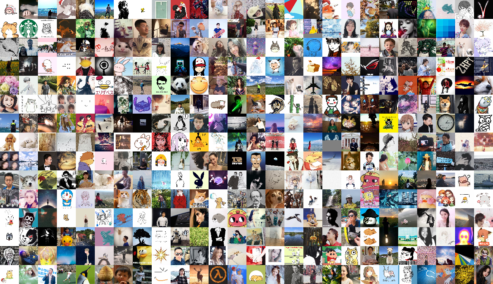
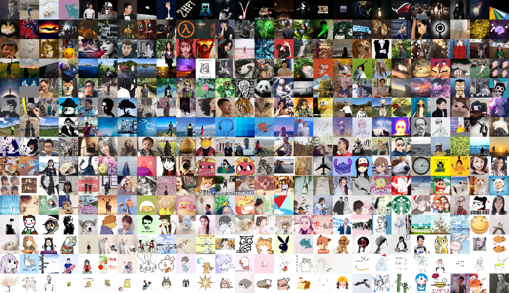
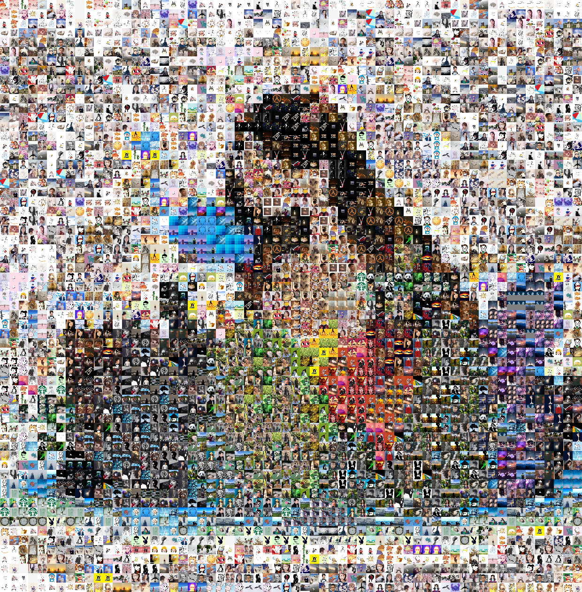

# 你的微信好友都长啥样？




## 系统要求

- Python >= 3.5
- 一个微信账号


## 安装 itchat, OpenCV, tqdm 和 scikit-learn

使用 Python 的 pip 指令安装

按 `Windows + R` 键打开命令行窗口，输入

```
pip3 install itchat opencv-python tqdm scikit-learn lap
```

NumPy和SciPy会作为Dependency自动安装

注：若lap安装不成功，请尝试安装lapsolver。 

scipy解二分图匹配的方法是纯Python写的，速度远远不能满足需求，所以我选择lap和lapsolver。

## 使用方法

1\. 使用[extract_img.py](extract_img.py)下载图片

下载自己所有好友的头像（--dir的参数是下载目录）：
```bash
python3 extract_img.py --dir img --type self
```
下载某个群聊里所有成员的头像（请把```name```换成群聊的名字并保留双引号）：
```bash
python3 extract_img.py --dir img2 --type chatroom --name "name"
```

2\. 使用[make_img.py](make_img.py)合成

#### 选项1:使用特定的排序方法

```bash
python3 make_img.py --path img --sort pca_lab --size 100
```

使用```--ratio w h```可修改横纵比，默认16:9。
如```--ratio 21 9```可改为21:9。

结果：


#### 选项2：拟合特定的图像

```bash
python3 make_img.py --path img --collage img/0.png --size 25 --dup 4
```

因为我不够社会导致我头像数量不够，我选择使用```--dup4```使得每个头像可以使用4次

结果：


#### 更多选项

要查看更多选项，请使用```python3 make_img.py --help```


